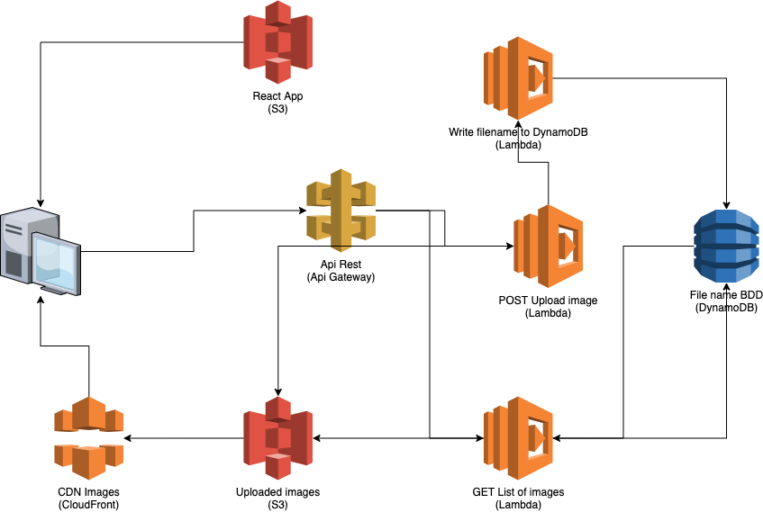

# Arbade Serverless Image Uploader

## Overall
Design a Serverless Image Uploader via AWS CDK.It would be able to see receive an image and save it to an S3 Bucket.It will also invoke another Lambda function to write data into a database.

## Table of Contents
1. [Overall](#overall)
2. [Pre-requirements](#pre-requirements)
3. [Project Tree](#project-tree)
4. [General Architecture](#general-architecture)
5. [Service Description](#service-descriptions)
6. [Cold Start](#cold-start)
    1. [Setting up the React application](#setting-up-the-react-application)
    2. [Installing the CDK, set up the env and deploy it to AWS](#setting-up-the-react-application)
    3. [Adding the API Gateway URL](#adding-the-api-gateway-url)
    4. [Tearing down your AWS resources](#tearing-down-your-aws-resources)
    5. [Miscalenous](#miscalenous)
7. [API References](#api-references)
    1. [React Web App Path References](#react-web-app-path-references)
    2. [Serverless API References](#serverless-api-references)
8. [Brain-Storming](#brain-storming)
    1. [High-Level-Design](#high-level-design)
    2. [HHL Descriptions](#hhl-descriptions)
    3. [Improvements](#improvements)

## Pre-requirements

- Python3 (3.9 is recommended).
- NodeJS and Npm (14.18 and 6.14 recommended)
- The AWS CDK (2.55 recommended)
- An AWS Account with your Access Key and Secret Access Key.

## Project Tree
will be added

## General Architecture

