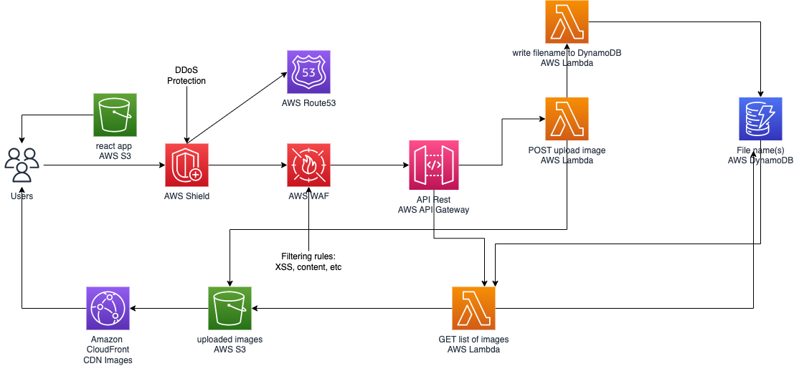

# Arbade Serverless Image Uploader

## Overall
Design a Serverless Image Uploader via AWS CDK.It would be able to see receive an image and save it to an S3 Bucket.It will also invoke another Lambda function to write data into a database.

## Table of Contents
1. [Overall](#overall)
2. [Pre-requirements](#pre-requirements)
3. [Project Tree](#project-tree)
4. [General Architecture](#general-architecture)
5. [Service Description](#service-descriptions)
6. [Cold Start](#cold-start)
    1. [Setting up the React application](#setting-up-the-react-application)
    2. [Installing the CDK, set up the env and deploy it to AWS](#setting-up-the-react-application)
    3. [Adding the API Gateway URL](#adding-the-api-gateway-url)
    4. [Tearing down your AWS resources](#tearing-down-your-aws-resources)
    5. [Miscalenous](#miscalenous)
7. [API References](#api-references)
    1. [React Web App Path References](#react-web-app-path-references)
    2. [Serverless API References](#serverless-api-references)
8. [Brain-Storming](#brain-storming)
    1. [High-Level-Design](#high-level-design)
    2. [HHL Descriptions](#hhl-descriptions)
    3. [Improvements](#improvements)

## Pre-requirements

- Python3 (3.9 is recommended).
- NodeJS and Npm (14.18 and 6.14 recommended)
- The AWS CDK (2.55 recommended)
- An AWS Account with your Access Key and Secret Access Key.

## Project Tree
will be added

## General Architecture

## Service Descriptions
It would be able to see service descriptions at the below that:
This is what our infrastructure looks like. Our project is composed of the following services:

- `S3` - the project is composed of two buckets: the one that will contain the code of our React application (which will allow us to upload the images) and another one that will contain all of our uploaded images.
- `Lambda` - these (serverless) functions will :
- - -> Receive an image and save it to an S3 Bucket. It will also invoke another Lambda function to write data into a database.
- - -> Write to the database the name of the image, its type, and its path in the S3 bucket.
- - -> Retrieve the images from DynamoDB and display them in the front-end.
- `API Gateway` - This is the front door to our API. This service, also serverless, will be in charge of putting us in communication with the right resource, Lambda functions for instance.
- `DynamoDB` - This is our database, also serverless. It’s not a relational database, as MySQL might be, it’s a NoSQL database.
- `CloudFront` - this is a CDN. Its role is to cache images coming from the S3 bucket.

## Cold-Start
#### Setting up the React application

- `cd front-app` - Go the Front-end directory project
- `yarn` - Install the dependencies
- `yarn start` - Launch the React project
- `yarn build` - Build a production version of the project. **You will need to
  do that if you want to deploy the project to AWS**

#### Installing the CDK, set up the env and deploy it to AWS
-  `npm install -g aws-cdk`: Install the AWS CDK
- `python3 -m venv .venv`: Create a virtualenv` on MacOS and Linux
- `source .venv/bin/activate`: Activate your virtualenv
- `% .venv\Scripts\activate.bat`: If you are on Windows, you would activate
  your virtualenv with this command.
- `pip install -r requirements.txt`: Once the virtualenv is activate,
  you can install the required dependencies.
- `cdk bootstrap`: Bootstrap the AWS CDK
- `cdk synth`: Synthethise the CDK code into a CloudFormation template
- `cdk deploy`: Deploy the project on AWS.

**WARNING**: you need to build your React application before runing the `cdk
deploy` command.

#### Adding the API Gateway URL

Before you go try upload images, copy the output of the deploy command, it
looks like this one: **https://4ooi3ccx66.execute-api.us-east-1.amazonaws.com/prod**

Copy and paste this link in the following files:

- `scripts/upload_images.py` - It's the BASE_URL
- `front-app/src/constants.ts`
#### Tearing down your AWS resources
- `cdk destroy`: delete the resources from your AWS account.

#### Miscalenous

There is `script` folder in the project. It contains images and a python script
and will populate some data to the project.

- `python scripts/upload_images.py` - Upload example images.

## API-References
It would be able to see API-References such as:

#### React Web App Path References
- It could be possible to access the react web app from local with `{PATH}`:
- localhost:3000/`{PATH}`

| PATH      | DESCRIPTION           |   |   |   |
|-----------|-----------------------|---|---|---|
| /         | Home Page             |   |   |   |
| /upload    | Image Upload Page     |   |   |   |
| /file-list | Uploaded Image Images |   |   |   |
#### Serverless API References
- It would be able to see API Gateway's References with AGW ID's such as:
- https://`{AGW_ID}`.execute-api.us-east-1.amazonaws.com/`{PATH}`
- E.g `https://1r4gala9jk.execute-api.us-east-1.amazonaws.com/prod/hello`

| PATH         | DESCRIPTION                   |   |
|--------------|-------------------------------|---|
| /prod/hello  | Hello, World from the AWS CDK |   |
| /prod/images | List of uploaded image(s)       |   |

Finally, It would be able to see uploaded image(s) via CloudFront Distribution Domain Name like as:
- `https://d86ogd2pwc8o1.cloudfront.net/20221223102916/Cat.jpeg`

## Brain-Storming

### High-Level-Design
- It would be able to see High Level Design of Case Study

### HHL Descriptions
- DDoS protection is implemented with AWS Shield and AWS WAF to mitigate both network and application layer attacks. AWS WAF is configured to block cross-site scripting, SQL injection, bad bots and user agents, and more.
- Amazon Route 53 DNS is protected with AWS Shield and anycast striping and shuffle sharding to ensure increased availability.
- Amazon CloudFront enables further DDoS mitigation by splitting any DDoS traffic across 100+ edge locations, and accelerating and caching content. It accelerates delivery of both static content such as HTML, CSS, and JavaScript (JS) via S3, and dynamic content served via API Gateway.
- API Gateway implements CORS protection, restricts requests to only valid clients and sources, and authorizes all requests based on your configured authorizers. It validates requests against defined resource policies, and inputs against defined API models, to block any requests which don’t conform to expected schema before invoking your respective integrations.

### Improvements

- Buckets must be private and it could be possible to access from over CloudFront.Maybe it is possible to change CloudFront Distribution and switch to `Legacy access identities` (`Use a CloudFront origin access identity (OAI) to access the S3 bucket.`) after then; `Create new OAI` from `Origin access identity`. Finally, update the bucket policy.
- In this repository, it's only possible to upload `jpeg` images.For the best practice case; it should be refactoring the code block and added some validation on application layer.At the end of day; application logic should be support all image types (E.g png,jpeg,svg..any etc)
- For the different scenarios; dev and test environment will be hosted private and accessible from internal facing Application Load Balancer and creating any VPN (such as OpenVPN) and accessible from VPN Tunnel for developers and test engineers
